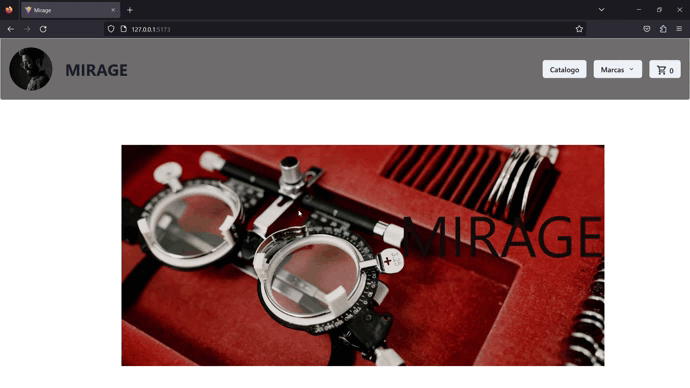

# E-Comerce óptica MIRAGE

>##  Tienda web para la venta digital de productos y servicios de óptica.

### Cuenta con las siguientes secciones:

* Sección de bienvenida
* Catalogo que nos redirecciona hacia todo el stock de productos donde cada unonos redirije hacia un completo detalle del producto permitiendonos agregar el mismo al carrito de compras.
* Menú desplegable con un filtro de productos por marca.
* Carrito de compras para realizar la transaccion final de la compra asignando un ID unico para futuras referencias de compra.
* En este proyecto se utiliza:
    - react-Router-Dom-npm
    - Para la base de datos: Firebase
    - Biblioteca de Chakra UI para implemetar el diseño del sitio
    

>#### Linkedin : https://www.linkedin.com/in/lucas-lioi-6abb2a15b/  

---"homepage": "https://optica-ecommerce.vercel.app/#/",

